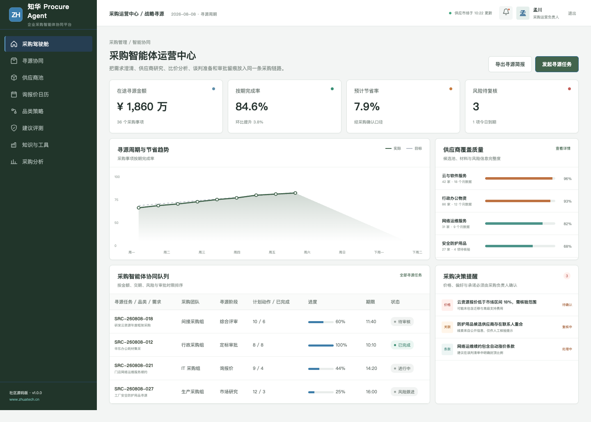
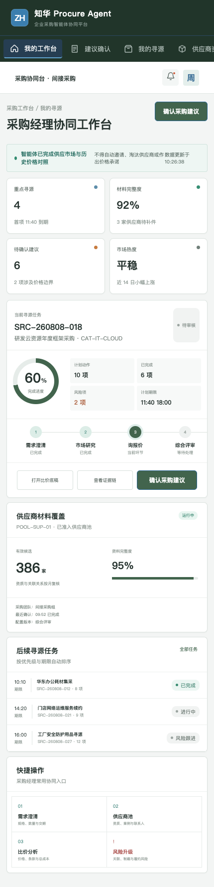

# ProcureAgent · 知华科技采购智能体

> 采购智能体整理证据，采购团队掌握谈判与定标。
>
> [知华科技（上海如静知华信息科技有限公司）官网](https://www.zhuatech.cn/) · 企业 AI 转型、Agent 定制、私有化部署与软件项目外包

面向采购运营、战略寻源和品类经理的 AI Agent 社区源码项目，覆盖需求澄清、供应商研究、询报价、多维比价、谈判准备、风险核验和定标审批。

## 从需求到定标

1. 明确需求范围、规格、数量、预算与交付条件。
2. 研究供应市场并建立有依据的候选池。
3. 归集报价和条款，按公开权重进行多维比较。
4. 核验关联、合规、履约与数据风险。
5. 由采购负责人或委员会完成谈判和定标决策。

## 产品界面

采购智能体运营中心提供跨团队任务、风险、建议评测和数据工具的运营视角。

采购经理协同工作台面向一线业务角色，保留证据、建议、人工确认和结果回写的完整链路。

## 主要能力

- 采购需求澄清与规格检查
- 供应市场和候选供应商研究
- 报价、条款与总成本对照
- 供应商关联与合规风险提示
- 谈判问题清单与边界建议
- 定标结论强制人工审批

## 工程实现

| 层次 | 技术与职责 |
| --- | --- |
| H5 / Web | Vue 3、Pinia、Vue Router、Axios、Vite，响应式适配桌面与移动端 |
| Java API | Java 21、Spring Boot、Spring Security、JWT、JPA、Bean Validation |
| Agent 边界 | AgentRuntime 可替换，默认只运行本地演示，不调用真实模型或业务系统 |
| 领域策略 | BidEvaluationService 提供可测试、可解释的业务安全规则 |
| 数据 | MySQL 8、Flyway；测试环境使用 H2 |
| 交付 | Docker Compose、Nginx、CI、API、架构、数据库和部署文档 |

公开价格、质量、交付和合规权重，输出候选建议但不会自动邀请、淘汰供应商或完成定标。

## 本地体验

仅查看演示界面：

~~~bash
cd frontend
npm install
npm run dev:demo
~~~

访问 http://localhost:5173。管理端使用 **planner / Demo@2026**，业务协同端使用 **operator / Demo@2026**。

完整部署参数见 [deploy/README.md](deploy/README.md)，接口见 [docs/api.md](docs/api.md)，架构边界见 [docs/architecture.md](docs/architecture.md)。

## 使用许可与商业授权

本工程采用知华科技社区源码许可，**仅限个人学习、研究和非商业技术交流，不得商用**。企业内部使用、生产部署、项目交付、SaaS、收费服务、二次销售、品牌替换或其他商业用途，必须事先取得上海如静知华信息科技有限公司书面授权。完整条款以 [LICENSE](LICENSE) 为准。

深度定制、私有化部署、商业授权、AI Agent 咨询和软件项目外包，可访问[知华科技官网](https://www.zhuatech.cn/)或扫码咨询。

| 商务与技术咨询 | 项目合作咨询 |
| --- | --- |
|  |  |

SEO 关键词：Procurement Agent,采购智能体,智能寻源,供应商比价 AI,SRM Agent,Java Vue 采购系统，知华科技，上海如静知华信息科技有限公司。

